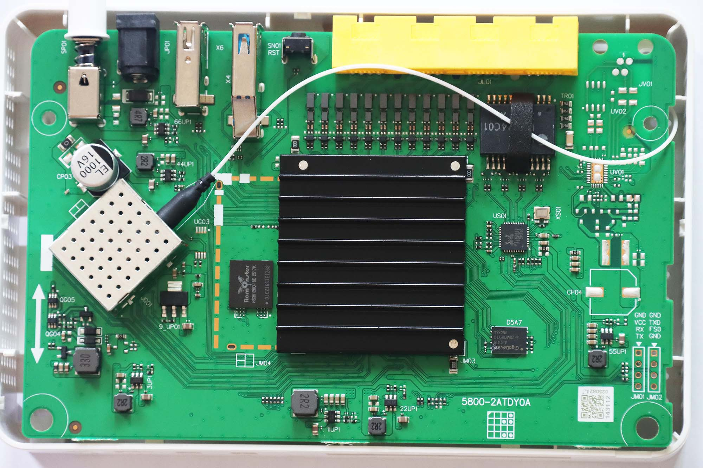
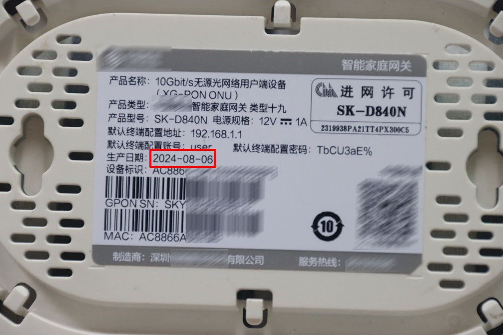
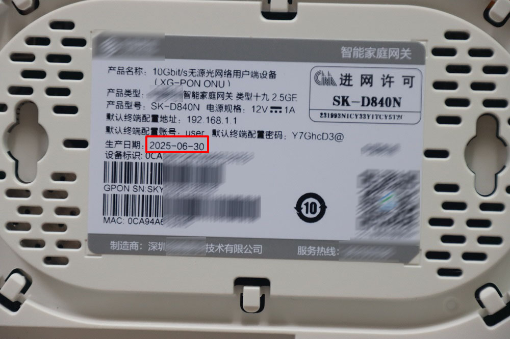
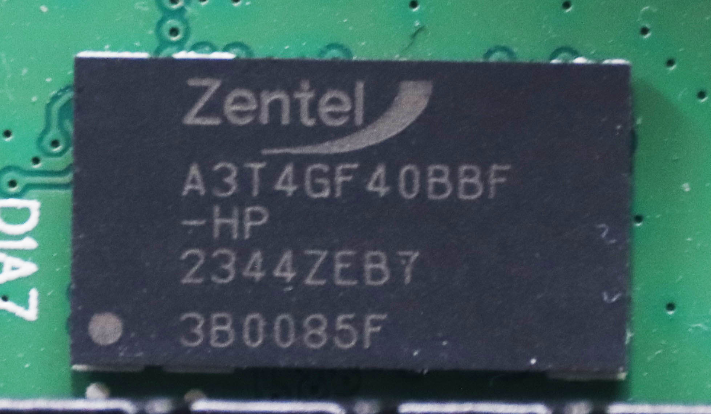
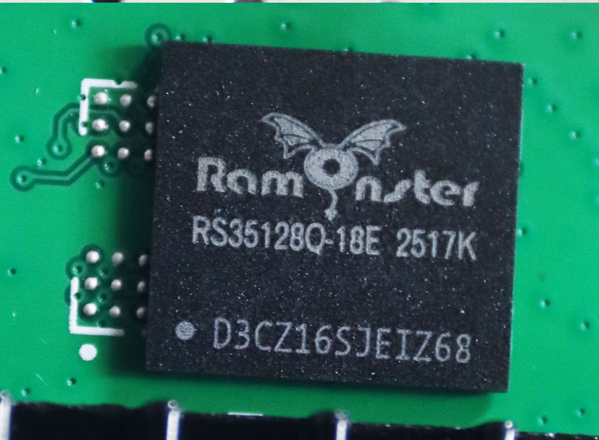
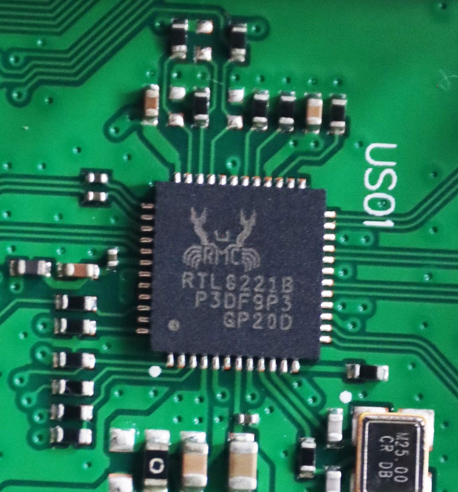
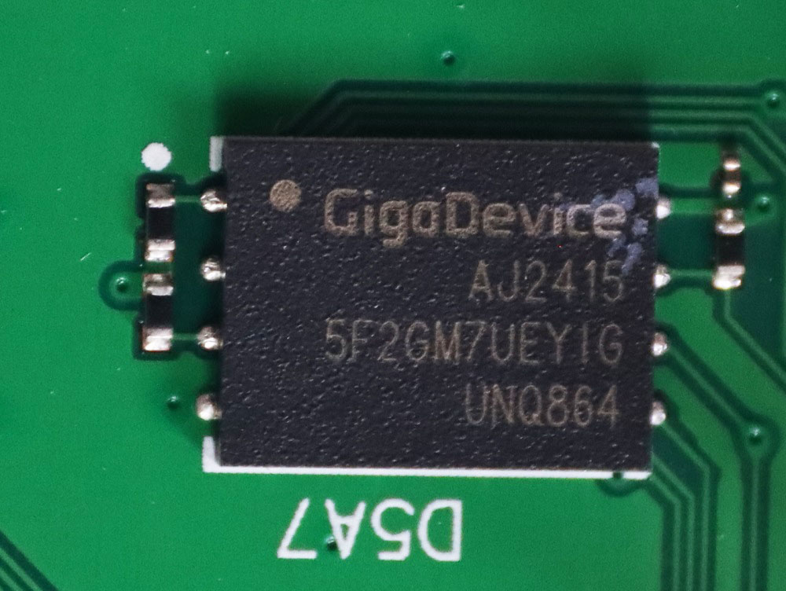

# SK-D840N-OpenWRT

**SK-D840N OpenWRT rootfs**



## Information

### Verified hardware version

|   V2024 |  V2025  |
| :-----: | :-----: |
|  |  |

### List of components

|         |  TYPE1  | TYPE2 |
| :-----: | :-----: | :-----: |
| DDR |  |  |
| ETH PHY |  |    |
| FLASH |  |    |

### Network support

|          | **eth0** | **eth1** | **eth2** | **eth3** | **wan** | **lan** |
| :------: | :------: | :------: | :------: | :------: | :-----: | :-----: |
| **eth0** |   —      |   ❌     |    ❌    |    ❌    |   ✅    |   ❌    |
| **eth1** |  ❌      |   —      |    ❌    |    ❌    |    ❌   |   ✅    |
| **eth2** |  ❌      |   ❌     |    —     |    ❌    |    ❌   |   ✅    |
| **eth3** |  ❌      |   ❌     |    ❌    |    —     |    ❌   |   ✅    |
| **wan**  |  ✅      |   ❌     |    ❌    |    ❌    |    —    |   ❌    |
| **lan**  |  ❌      |   ✅     |    ✅    |    ✅    |    ❌   |   —     |

### USB support

|       | **name** | **status** | 
| :---: | :------: | :--------: |
| **1** | USB 2.0  |    ✅      |
| **2** | USB 3.0  |    ✅      |

### rootfs template

* from: [generic-ext4-rootfs.img.gz](https://downloads.openwrt.org/releases/24.10.8/targets/armsr/armv8/openwrt-24.10.8-armsr-armv8-generic-ext4-rootfs.img.gz)
* release page: [releases](https://downloads.openwrt.org/releases/24.10.8/targets/armsr/armv8/)
* gcc: [gcc-13.3.0-musl.Linux-x86-64.tar.zst](https://downloads.openwrt.org/releases/24.10.8/targets/armsr/armv8/openwrt-toolchain-24.10.8-armsr-armv8_gcc-13.3.0_musl.Linux-x86_64.tar.zst)

## Quick Start

## Manual Packaging

### System Environment
```shell
# Ubuntu 22.04
> cat /proc/version
Linux version 6.5.0-35-generic (buildd@lcy02-amd64-079) (x86_64-linux-gnu-gcc-12 (Ubuntu 12.3.0-1ubuntu1~22.04) 12.3.0, GNU ld (GNU Binutils for Ubuntu) 2.38) #35~22.04.1-Ubuntu SMP PREEMPT_DYNAMIC Tue May  7 09:00:52 UTC 2
```

### Get the repository && Init
```shell
sudo su
git clone https://github.com/huxiangjs/SK-D840N-OpenWRT.git
cd SK-D840N-OpenWRT
./scripts/gitkeep.sh install
```


